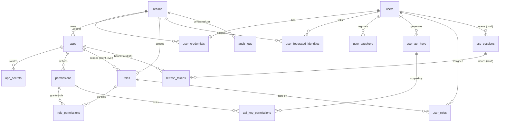

# TECHNICAL DESIGN DOCUMENT — PHASE 1 CORE (FRS & DATABASE SCHEMA)
**Project Name:** One-SHW — Centralized Identity Provider (IdP) & Access Management System
**Document Version:** v1.1
**Database Engine:** PostgreSQL
**Reference:** `01-REQUIREMENTS/BRD_One-SHW_Identity_Access_Management_v1.0.md`

---

## 0. Konvensi Umum

* Semua timestamp pakai **Epoch/Unix Timestamp** dalam kolom `BIGINT` (`created_at`, `updated_at`) — sesuai **NFR-3**.
* Semua TTL / lifetime numerik (Redis `EX`, API `session.ttl`, cookie `maxAge`, kolom `*_seconds` / `*_lifetime`) dalam **detik** (integer). Prose boleh menyebut durasi manusiawi (mis. “15 menit”) selama nilai numerik tetap dalam detik.
* Semua secret/password **WAJIB** disimpan dalam bentuk hash, tidak boleh plaintext — sesuai **REQ-4.3.2**.
* Kolom yang butuh pencarian cepat (hash lookup, identifier publik) di-set **UNIQUE INDEX** supaya Postgres otomatis bikin B-Tree Index — sesuai **NFR-2**.
* Isolasi multi-tenant berbasis `realm_id` — sesuai **REQ-4.1.1**. Konsekuensinya: unique constraint untuk identifier user (email, username, no HP) di-scope **per realm**, bukan global.

---

## 1. FUNCTIONAL REQUIREMENT SPECIFICATIONS (API)

Berikut adalah kontrak API *Custom* yang akan dibangun di dalam **Auth Service** (Golang). API ini didesain secara *headless* untuk dikonsumsi oleh **FE SSO (Astro)**.

> **Catatan OIDC Standar:** Endpoint standar bawaan Ory Fosite seperti `/oauth2/auth` (Authorization Code) dan `/oauth2/token` (Token Exchange) tidak dirincikan secara mendalam di sini karena mengikuti standar spesifikasi mutlak IETF OAuth 2.0 / OpenID Connect.

### 1.1. Inisiasi / Identifikasi Pengguna (Check Username/Email)
Langkah pertama login. FE SSO mengirimkan email/username. Backend mengecek user ada di *realm* mana, dan membuat *Stateful Auth Flow* di Redis (TTL Redis 900 detik / 15 menit).

**Endpoint:** `POST /api/v1/auth/identify`

**Request Payload (JSON):**
```json
{
  "identifier": "user@example.com"
}
```

**Response - Berhasil:**
```json
{
  "status": "success",
  "data": {
    "auth_session_id": "flow-xyz-123",
    "next_step": "AWAITING_PASSWORD",
    "realm": "b2c_public"
  }
}
```

### 1.2. Cek Status Flow (Untuk Hard Refresh / SSR Astro)
Digunakan oleh Astro SSR setiap kali halaman dimuat ulang (*hard refresh*). Astro mengirimkan `auth_session_id` dari *cookie*, dan Backend akan memberitahu halaman apa yang harus dirender agar *user* tidak terlempar kembali ke awal.

**Endpoint:** `GET /api/v1/auth/flow/status?id=flow-xyz-123`

**Response:**
```json
{
  "status": "success",
  "data": {
    "current_step": "AWAITING_MFA_SELECTION",
    "expires_in_seconds": 600,
    "available_mfa_methods": ["email", "totp"]
  }
}
```

### 1.3. Validasi Kredensial (Password)
Langkah kedua. FE SSO mengirimkan password berdasarkan `auth_session_id`.

**Endpoint:** `POST /api/v1/auth/password`

**Request Payload (JSON):**
```json
{
  "auth_session_id": "session-xyz-123",
  "password": "SecurePassword123!"
}
```

**Response - Berhasil (Tanpa MFA):**
```json
{
  "status": "success",
  "data": {
    "login_challenge": "abc-123",
    "redirect_to": "https://auth.voyago.com/oauth2/consent?login_challenge=abc-123"
  }
}
```

**Response - Butuh MFA (Pilih Metode):**
```json
{
  "status": "requires_mfa",
  "message": "Silakan pilih metode Autentikasi Dua Langkah (2FA)",
  "data": {
    "available_methods": ["email", "totp", "webauthn"]
  }
}
```

### 1.4. Pilih Metode MFA (Trigger Challenge)
Langkah ketiga (Jika user butuh MFA). FE SSO mengirimkan metode yang dipilih user. Backend akan memicu pengiriman OTP ke email atau menyiapkan *challenge* untuk FIDO2.

**Endpoint:** `POST /api/v1/auth/mfa/select`

**Request Payload (JSON):**
```json
{
  "auth_session_id": "session-xyz-123",
  "method": "email"
}
```

**Response - Challenge Dikirim:**
```json
{
  "status": "challenge_sent",
  "message": "Kode OTP telah dikirimkan ke email Anda",
  "data": {
    "method": "email",
    "target_masked": "u***r@example.com"
  }
}
```

### 1.5. Validasi MFA / OTP
Langkah terakhir. FE SSO memvalidasi kode yang dimasukkan user.

**Endpoint:** `POST /api/v1/auth/mfa/verify`

**Request Payload (JSON):**
```json
{
  "auth_session_id": "session-xyz-123",
  "code": "123456"
}
```

**Response - Berhasil:**
```json
{
  "status": "success",
  "message": "MFA berhasil diverifikasi",
  "data": {
    "login_challenge": "abc-123",
    "redirect_to": "https://auth.voyago.com/oauth2/consent?login_challenge=abc-123"
  }
}
```

### 1.6. Logout (Akhiri Sesi)
Digunakan untuk mencabut sesi pengguna secara sadar dari sisi IdP.

**Endpoint:** `POST /api/v1/auth/logout`

**Request Payload (JSON):**
```json
{
  "logout_challenge": "xyz-789"
}
```

**Response - Berhasil:**
```json
{
  "status": "success",
  "redirect_to": "https://app.voyago.com"
}
```

### 1.7. OIDC Discovery & JWKS (Publik)
Endpoint standar bawaan Ory Fosite yang dikonsumsi secara independen oleh **Internal API Gateway (Traefik)** dan aplikasi klien untuk memvalidasi JWT secara *stateless*.

*   **Endpoint:** `GET /.well-known/openid-configuration`
    *(Mengembalikan meta-data OIDC seperti alamat endpoint token, jwks_uri, format token, dll)*.
*   **Endpoint:** `GET /.well-known/jwks.json`
    *(Mengembalikan daftar Public Keys (RSA/ECDSA) untuk verifikasi signature JWT)*.

---

## 2. DATABASE SCHEMA (PostgreSQL)

### 2.1. ZONA 1: Multi-Tenancy (Realm Management)

### Tabel `realms`
| Column | Type | Notes |
| ------ | ---- | ----- |
| **--- KEYS & IDENTIFIERS ---** | | |
| `id` | INT | PK (Di Postgres pakai `GENERATED ALWAYS AS IDENTITY`). |
| `name` | VARCHAR(50) | NOT NULL, UNIQUE. Contoh: `b2c_public`, `tenant_alpha_corp` (REQ-4.1.1). |
| `description` | TEXT | Optional. |
| **--- BRANDING & UI ---** | | |
| `brand_settings` | JSONB | Optional. Nyimpen logo_url, warna, tema, dll (REQ-4.1.2). |
| **--- STRATEGY & SECURITY ---** | | |
| `login_strategy` | VARCHAR(20) | Optional / Nullable. Enum: `LOCAL`, `LDAP` (Default: NULL / Bebas). LDAP = Phase 2 (REQ-4.3.9). |
| `ldap_config` | JSONB | Optional. Konfigurasi IP, Port, Bind DN jika strategi = LDAP. |
| `max_incorrect_password` | SMALLINT | NOT NULL, **DEFAULT 5**. Batas gagal login sebelum akun dikunci sementara (*Temporary Lock*). |
| `lockout_duration_seconds` | INT | NOT NULL, **DEFAULT 900** (15 menit). Durasi *temporary lock*. |
| `max_lockout_count` | SMALLINT | NOT NULL, **DEFAULT 3**. Batas maksimal *temporary lock* berturut-turut sebelum akun terkena *Permanent Lock* (harus dibuka Admin). |
| `sso_session_idle_timeout_seconds` | INT | NOT NULL, **DEFAULT 86400** (24 jam). Batas waktu nganggur (*idle*) sebelum sesi SSO pusat hangus. |
| `sso_session_absolute_timeout_seconds` | INT | NOT NULL, **DEFAULT 2592000** (30 hari). Batas waktu hidup absolut sesi SSO pusat (menjadi "Batas Maksimal" untuk umur Refresh Token semua aplikasi). |
| `enforce_mfa_since` | BIGINT | Optional. Epoch format. Jika `now >= enforce_mfa_since`, semua user WAJIB setup MFA. Jika NULL, tidak dipaksa. Mendukung enforcement instan (`now`) atau terjadwal. |
| **--- FEATURE FLAGS (UI & CAPABILITIES) ---** | | |
| `allowed_recover_account` | BOOLEAN | NOT NULL, DEFAULT true. |
| `allowed_change_password` | BOOLEAN | NOT NULL, DEFAULT true. |
| `allowed_change_personal_info` | BOOLEAN | NOT NULL, DEFAULT true. |
| `allowed_mfa` | BOOLEAN | NOT NULL, DEFAULT true. (Capability: user BOLEH nyalain MFA. Beda dengan `enforce_mfa_since` yang sifatnya memaksa). |
| `allowed_passkey` | BOOLEAN | NOT NULL, DEFAULT true. |
| **--- SYSTEM STATUS ---** | | |
| `is_system` | BOOLEAN | NOT NULL, DEFAULT false. (Penanda realm bawaan pusat/super admin). |
| `is_active` | BOOLEAN | NOT NULL, DEFAULT true. (Kill-switch kalau klien nunggak/blokir). |
| **--- AUDIT ---** | | |
| `created_at` | BIGINT | NOT NULL. Epoch format. |
| `updated_at` | BIGINT | Optional. Epoch format. |

> **Perubahan dari draft awal:** `max_incorrect_password` default diturunkan dari 10 → 5, penambahan `lockout_duration_seconds`, penambahan `max_lockout_count` untuk eskalasi ke *Permanent Lock*, dan pengubahan `enforce_mfa` menjadi `enforce_mfa_since` untuk *window-time* (jadwal).

### Tabel `social_login_providers` (Sistem Global)
Tabel ini bersifat global (tidak terikat pada `realms`) untuk menyimpan kredensial OAuth 2.0 dari penyedia layanan pihak ketiga secara terpusat.

| Column | Type | Notes |
| ------ | ---- | ----- |
| **--- KEYS ---** | | |
| `id` | VARCHAR(20) | PK. Identifier provider. Contoh: `GOOGLE`, `APPLE`. |
| **--- UI CONFIG ---** | | |
| `name` | VARCHAR(50) | NOT NULL. Nama internal provider (contoh: "google"). |
| `title` | VARCHAR(100) | NOT NULL. Teks untuk tombol di UI (contoh: "Sign in with Google"). |
| `logo_base64` | TEXT | Optional. Logo provider dalam format Base64 untuk dirender langsung di UI. |
| **--- OAUTH CREDENTIALS ---** | | |
| `client_id` | VARCHAR(255) | NOT NULL. Client ID dari provider OAuth. |
| `client_secret` | TEXT | NOT NULL. Client Secret dari provider. **Wajib dienkripsi** (AES-GCM/Encrypted-at-Rest) karena backend butuh nilai aslinya (plaintext) saat memanggil API provider. |
| **--- SYSTEM STATUS ---** | | |
| `is_active` | BOOLEAN | NOT NULL, DEFAULT true. Tombol otomatis hilang dari UI SSO jika false. |
| **--- AUDIT ---** | | |
| `created_at` | BIGINT | NOT NULL. Epoch format. |
| `updated_at` | BIGINT | Optional. Epoch format. |

---

### 2.2. ZONA 2: Identity & Keamanan (Users & Credentials)

### Tabel `users` (Biodata — Single Source of Truth Identity)
| Column | Type | Notes |
| ------ | ---- | ----- |
| **--- KEYS & RELATIONS ---** | | |
| `id` | UUID | PK. |
| **--- PERSONAL INFO (BIODATA) ---** | | |
| `first_name` | VARCHAR(100) | NOT NULL. |
| `middle_name` | VARCHAR(100) | Optional. |
| `last_name` | VARCHAR(100) | Optional. |
| `gender` | VARCHAR(1) | **Optional.** Check: IN ('M', 'F'). |
| `date_of_birth` | DATE | **Optional.** |
| **--- PRIMARY CONTACTS ---** | | |
| `primary_email` | VARCHAR(100) | Optional. |
| `country_code` | VARCHAR(5) | Optional. |
| `mobile_no` | VARCHAR(15) | Optional. |
| **--- ADDITIONAL DETAILS ---** | | |
| `profile_picture` | TEXT | Optional. |
| `additional_info` | TEXT | Optional. |
| **--- AUDIT ---** | | |
| `created_at` | BIGINT | NOT NULL. Epoch format. |
| `updated_at` | BIGINT | Optional. Epoch format. |

> **Perubahan dari draft awal:** `gender` dan `date_of_birth` dilonggarkan jadi Optional. Alasannya REQ-4.3.8 (Social Login masuk Phase 1 MVP): Google/Apple cuma ngasih nama + email saat federated onboarding. Kalau dua kolom ini NOT NULL, flow "seamless B2C onboarding" (Persona: Budi) bakal patah karena user dipaksa isi form dulu. Data ini bisa dilengkapi belakangan via progressive profiling.

### Tabel `user_credentials`
| Column | Type | Notes |
| ------ | ---- | ----- |
| **--- KEYS & RELATIONS ---** | | |
| `user_id` | UUID | PK, FK ke `users.id`. |
| `realm_id` | INT | NOT NULL, FK ke `realms.id`. |
| **--- IDENTIFIERS ---** | | |
| `email` | VARCHAR(100) | NOT NULL. (Primary login, REQ-4.3.1). UNIQUE INDEX **(realm_id, email)**. |
| `username` | VARCHAR(30) | Optional. UNIQUE INDEX **(realm_id, username)**. |
| `country_code` | VARCHAR(5) | Optional. |
| `mobile_no` | VARCHAR(15) | Optional. |
| **--- AUTH & SECURITY ---** | | |
| `password_hash` | TEXT | Optional (Bcrypt/Argon2, REQ-4.3.2). Khusus strategi `LOCAL`. NULL kalau user murni social login. |
| `login_attempt` | SMALLINT | NOT NULL, DEFAULT 0. (Counter salah password). |
| `use_2fa` | BOOLEAN | NOT NULL, DEFAULT false. |
| `totp_secret` | TEXT | Optional. Shared secret TOTP (REQ-4.3.4), disimpan **encrypted-at-rest** (AES-GCM), bukan plaintext. |
| `last_activated_2fa_at` | BIGINT | Optional. Epoch format. |
| `last_change_password_at` | BIGINT | Optional. Epoch format. |
| **--- STATUS & CONTROL ---** | | |
| `force_change_password` | BOOLEAN | NOT NULL, DEFAULT true. |
| `locked_until` | BIGINT | Optional. Epoch. Temporary lock: diisi `now + realms.lockout_duration_seconds` saat `login_attempt` mencapai batas. Login ditolak selama `now < locked_until`. |
| `lockout_count` | SMALLINT | NOT NULL, DEFAULT 0. Counter berapa kali akun ini terkena *temporary lock*. Jika mencapai `realms.max_lockout_count`, status dilempar ke `is_locked = true`. Reset ke 0 jika login sukses. |
| `is_locked` | BOOLEAN | NOT NULL, DEFAULT false. **Permanent Lock** (Oleh sistem akibat eskalasi *brute-force*, atau manual oleh Admin via *Kill-Switch*). |
| `deleted_at` | BIGINT | Optional. Epoch format. (Soft Delete ORM-friendly — Nullable, NFR-02). |
| **--- AUDIT ---** | | |
| `created_at` | BIGINT | NOT NULL. Epoch format. |
| `updated_at` | BIGINT | Optional. Epoch format. |

*(Wajib bikin UNIQUE INDEX untuk combo: `realm_id` + `country_code` + `mobile_no`)*

### Tabel `user_federated_identities` (Social Login — BARU, Phase 1 MVP)
Wajib ada di Phase 1 karena REQ-4.3.8 (Social Login via Google/Apple) masuk scope MVP.

| Column | Type | Notes |
| ------ | ---- | ----- |
| **--- KEYS & RELATIONS ---** | | |
| `id` | UUID | PK. |
| `user_id` | UUID | NOT NULL, FK ke `users.id`. |
| `realm_id` | INT | NOT NULL, FK ke `realms.id`. |
| **--- PROVIDER IDENTITY ---** | | |
| `provider` | VARCHAR(20) | NOT NULL. Enum: `GOOGLE`, `APPLE`. (Extensible untuk provider lain). |
| `provider_user_id` | VARCHAR(255) | NOT NULL. `sub` claim dari ID Token provider. |
| `provider_email` | VARCHAR(100) | Optional. Email dari provider saat linking (buat troubleshooting/display). |
| **--- AUDIT ---** | | |
| `created_at` | BIGINT | NOT NULL. Epoch format. |
| `updated_at` | BIGINT | Optional. Epoch format. |

### Tabel `user_passkeys` (FIDO2/WebAuthn — Schema Phase 1, Aktivasi Phase 2)
Sesuai REQ-4.3.3: struktur disiapkan sejak Phase 1 biar nggak ada migrasi besar di Phase 2.

| Column | Type | Notes |
| ------ | ---- | ----- |
| `id` | UUID | PK. |
| `user_id` | UUID | NOT NULL, FK ke `users.id`. |
| `name` | VARCHAR(100) | Optional. Label device buat UI. Contoh: "iPhone Vian", "YubiKey Kantor". |
| `credential_id` | TEXT | NOT NULL, **UNIQUE INDEX**. ID Passkey dari browser/HP. |
| `public_key` | TEXT | NOT NULL. Kunci kriptografi validasi. |
| `sign_count` | INT | NOT NULL, DEFAULT 0. Validasi FIDO anti-cloning (penjelasan di bawah). |
| `last_used_at` | BIGINT | Optional. Epoch format. |
| `is_active` | BOOLEAN | NOT NULL, DEFAULT true. (Revoke device tanpa hapus histori). |
| `created_at` | BIGINT | NOT NULL. Epoch format (NFR-3). |
| `updated_at` | BIGINT | Optional. Epoch format (NFR-3). |

---

## 2.3. ZONA 3: Application Management, Dynamic RBAC & Otorisasi (IAM)

### Tabel `apps` (Profil Aplikasi & Konfigurasi)
| Column | Type | Notes |
| ------ | ---- | ----- |
| **--- KEYS & IDENTIFIERS ---** | | |
| `id` | UUID | PK. |
| `realm_id` | INT | NOT NULL, FK ke `realms.id`. Aplikasi terdaftar di bawah satu realm (tenant isolation, REQ-4.1.1). |
| `client_id` | VARCHAR(150) | NOT NULL, UNIQUE INDEX. Identifier publik aplikasi. |
| **--- APP PROFILE ---** | | |
| `name` | VARCHAR(150) | NOT NULL. Contoh: "Voyago Web". |
| `brand_url` | TEXT | Optional. |
| **--- OAUTH 2.0 CONFIG ---** | | |
| `redirect_uris` | JSONB | NOT NULL. Array whitelist callback URI. **Wajib** buat validasi `redirect_uri` di Authorization Code flow (Bab 4.6 Step 2 & 4) — tanpa ini rawan Open Redirect attack. |
| `backchannel_logout_uri` | TEXT | Optional. Endpoint BFF yang di-notify IdP saat Single Logout (Bab 4.6 Step 7). |
| **--- CONFIG & LIFETIME ---** | | |
| `max_access_token_lifetime` | INT | NOT NULL, DEFAULT 3600. Umur JWT dalam detik. **Aturan:** Nilainya wajib lebih kecil atau sama dengan (`<=`) `max_refresh_token_lifetime`. |
| `max_refresh_token_lifetime` | INT | NOT NULL, DEFAULT 2592000 (30 hari). Umur refresh token dalam detik. **Aturan:** Nilainya wajib lebih kecil atau sama dengan (`<=`) `realms.sso_session_absolute_timeout_seconds`. |
| **--- SYSTEM STATUS ---** | | |
| `is_system` | BOOLEAN | NOT NULL, DEFAULT false. Cegah app bawaan dihapus. |
| `is_active` | BOOLEAN | NOT NULL, DEFAULT true. |
| **--- AUDIT ---** | | |
| `created_at` | BIGINT | NOT NULL. Epoch format. |
| `updated_at` | BIGINT | Optional. Epoch format. |

### Tabel `app_secrets` (Wadah Secret Rotation)
Mendukung **Zero-Downtime Secret Rotation** (REQ-4.2.2): satu app boleh punya beberapa secret aktif sekaligus selama masa transisi.

| Column | Type | Notes |
| ------ | ---- | ----- |
| **--- KEYS ---** | | |
| `id` | UUID | PK. |
| `app_id` | UUID | NOT NULL. FK ke `apps.id`. |
| **--- CREDENTIALS ---** | | |
| `client_secret_hash` | VARCHAR(255) | NOT NULL, **UNIQUE INDEX**. Disimpan dalam bentuk Hash (Bcrypt/Argon2). JANGAN simpan plain text. |
| `description` | TEXT | Optional. Contoh: "Secret V1", "Rotasi Q3 2026". |
| **--- LIFETIME & STATUS ---** | | |
| `expires_at` | BIGINT | Optional (Epoch). Kalau NULL = aktif selamanya. Kalau terisi = secret ini mati otomatis (masa transisi rotasi, REQ-4.2.2). |
| `is_active` | BOOLEAN | NOT NULL, DEFAULT true. Buat matiin secret lama (Revoke). |
| **--- AUDIT ---** | | |
| `created_at` | BIGINT | NOT NULL. Epoch format. |

### Tabel `user_api_keys` (Personal Access Tokens — Schema Phase 1, Aktivasi Phase 2)
Sesuai Bab 2: schema disiapkan di Phase 1, UI generation & middleware validasi aktif di Phase 2.

| Column | Type | Notes |
| ------ | ---- | ----- |
| **--- KEYS ---** | | |
| `id` | UUID | PK. |
| `user_id` | UUID | NOT NULL. FK ke `users.id`. |
| **--- CREDENTIALS ---** | | |
| `name` | VARCHAR(100) | NOT NULL. |
| `api_key_hash` | VARCHAR(255) | NOT NULL, **UNIQUE INDEX**. **SHA-256** (REQ-4.5.2) — deterministic hash, bukan Bcrypt, supaya bisa exact-match lookup lewat B-Tree index (NFR-2). Plaintext key cuma ditampilkan SEKALI saat creation. |
| `key_prefix` | VARCHAR(20) | NOT NULL. Prefix statis, contoh: `shw_prod_`, `shw_test_` (REQ-4.5.3 — buat visual dashboard & secret scanning). |
| **--- STATUS & TRACKING ---** | | |
| `expires_at` | BIGINT | Optional (Epoch). |
| `last_used_at` | BIGINT | Optional (Epoch). |
| `is_active` | BOOLEAN | NOT NULL, DEFAULT true. |
| **--- AUDIT ---** | | |
| `created_at` | BIGINT | NOT NULL. Epoch format. |
| `updated_at` | BIGINT | Optional. Epoch format. |

### Tabel `api_key_permissions` (Scoping API Key — BARU)
Wajib ada untuk REQ-4.5.4 (**Least Privilege**): akses API Key dibatasi hanya ke scope yang di-assign, meskipun user pemiliknya punya permission lebih luas.

| Column | Type | Notes |
| ------ | ---- | ----- |
| **--- KEYS (COMPOSITE PK) ---** | | |
| `api_key_id` | UUID | PK & FK ke `user_api_keys.id`. |
| `permission_id` | UUID | PK & FK ke `permissions.id`. |
| **--- AUDIT ---** | | |
| `created_at` | BIGINT | NOT NULL. Epoch format. |

### Tabel `permissions` (Daftar Aksi / Tombol — Data untuk Dynamic RBAC)
| Column | Type | Notes |
| ------ | ---- | ----- |
| **--- KEYS & RELATIONS ---** | | |
| `id` | UUID | PK. |
| `app_id` | UUID | NOT NULL. FK ke `apps.id`. (Permission nempel per aplikasi — REQ-4.4.1, hardcoded actions). |
| **--- DETAILS ---** | | |
| `name` | VARCHAR(150) | NOT NULL. Contoh: `submit_timesheet`, `view_payslip`. |
| `description` | VARCHAR(255) | Optional. Penjelasan buat di UI Dashboard Admin. |
| **--- AUDIT ---** | | |
| `created_at` | BIGINT | NOT NULL. Epoch format. |
| `updated_at` | BIGINT | Optional. Epoch format. |

### Tabel `roles` (Jabatan / Kantong Akses)
| Column | Type | Notes |
| ------ | ---- | ----- |
| **--- KEYS & RELATIONS ---** | | |
| `id` | UUID | PK. |
| `realm_id` | INT | NOT NULL, FK ke `realms.id`. |
| `app_id` | UUID | **Optional (Nullable)**, FK ke `apps.id`. **NULL = Realm-level role** (berlaku di semua app dalam realm). **Terisi = Client-level role** (spesifik satu app). Sesuai REQ-4.4.4. |
| **--- DETAILS ---** | | |
| `name` | VARCHAR(150) | NOT NULL. Contoh: "Tenaga Kerja", "Voyago Admin". |
| `description` | VARCHAR(255) | Optional. |
| **--- SYSTEM STATUS ---** | | |
| `is_custom` | BOOLEAN | NOT NULL, DEFAULT true. Penanda role buatan user atau bawaan sistem/hardcoded. |
| `is_active` | BOOLEAN | NOT NULL, DEFAULT true. |
| **--- AUDIT ---** | | |
| `created_at` | BIGINT | NOT NULL. Epoch format. |
| `updated_at` | BIGINT | Optional. Epoch format. |

### Tabel `role_permissions` (Penyambung Jabatan & Aksi)
| Column | Type | Notes |
| ------ | ---- | ----- |
| **--- KEYS (COMPOSITE PK) ---** | | |
| `role_id` | UUID | PK & FK ke `roles.id`. |
| `permission_id` | UUID | PK & FK ke `permissions.id`. |
| **--- AUDIT ---** | | |
| `created_at` | BIGINT | NOT NULL. Epoch format. |

### Tabel `user_roles` (Pemberian Jabatan ke User)
| Column | Type | Notes |
| ------ | ---- | ----- |
| **--- KEYS (COMPOSITE PK) ---** | | |
| `user_id` | UUID | PK & FK ke `users.id`. |
| `role_id` | UUID | PK & FK ke `roles.id`. |
| **--- AUDIT ---** | | |
| `created_at` | BIGINT | NOT NULL. Epoch format. |

---

## 2.4. ZONA 4: Audit & Compliance

### Tabel `audit_logs` (BARU — Wajib per NFR-5)
Log **immutable**: aplikasi cuma boleh INSERT. Nggak ada `updated_at`, dan role DB aplikasi jangan dikasih grant UPDATE/DELETE di tabel ini.

| Column | Type | Notes |
| ------ | ---- | ----- |
| **--- KEYS ---** | | |
| `id` | BIGINT | PK (`GENERATED ALWAYS AS IDENTITY`). Volume tinggi, BIGSERIAL lebih hemat & cepat daripada UUID. |
| `realm_id` | INT | Optional. FK ke `realms.id`. NULL untuk event global/sistem. |
| **--- WHO (ACTOR) ---** | | |
| `actor_type` | VARCHAR(20) | NOT NULL. Enum: `USER`, `SYSTEM`, `API_KEY`, `APP`. |
| `actor_id` | VARCHAR(100) | Optional. User ID / App ID / identifier lain sesuai actor_type. |
| **--- WHAT (ACTION & RESOURCE) ---** | | |
| `action` | VARCHAR(100) | NOT NULL. Contoh: `LOGIN_SUCCESS`, `LOGIN_FAILED`, `PASSWORD_CHANGED`, `MFA_ENABLED`, `CLIENT_SECRET_ROTATED`, `ROLE_PERMISSION_ADDED`. |
| `resource_type` | VARCHAR(50) | Optional. Contoh: `USER`, `APP`, `ROLE`. |
| `resource_id` | VARCHAR(100) | Optional. ID resource yang kena efek. |
| `status` | VARCHAR(10) | NOT NULL. Enum: `SUCCESS`, `FAILURE`. |
| **--- WHERE (SOURCE & TRACE) ---** | | |
| `ip_address` | INET | Optional. Source IP request. |
| `user_agent` | TEXT | Optional. |
| `trace_id` | VARCHAR(100) | Optional. OpenTelemetry Trace ID untuk distributed tracing (NFR-01). |
| **--- DETAIL ---** | | |
| `metadata` | JSONB | Optional. Konteks tambahan (misal: reason failure, old/new value non-sensitif). |
| **--- WHEN ---** | | |
| `created_at` | BIGINT | NOT NULL. Epoch format. |

*(Index yang disarankan: `(realm_id, created_at DESC)` untuk dashboard per tenant, dan `(actor_id, created_at DESC)` untuk trace aktivitas per user. Kalau volume udah gede, pertimbangkan table partitioning by range `created_at`).*

---

## 2.5. ZONA 5: Session & Refresh Token (Persistent Storage)

> **Arsitektur Hybrid (Postgres + Redis):** Sesuai dengan NFR-04, validasi *hot path* untuk sesi dan *refresh token* dikelola di **Redis** (In-Memory Cache) demi *horizontal scaling*. Namun, data tetap di-*insert* ke tabel Postgres di bawah ini sebagai *Source of Truth* (Persistent Storage) untuk kebutuhan *audit trail*, *dashboard* pengelolaan sesi aktif (seperti fitur "Log out from all devices"), dan ketahanan data (*failover*) apabila data di Redis terhapus/mengalami *eviction*.

### Tabel `sso_sessions`
Merepresentasikan satu sesi login user di IdP (basis untuk SSO & SLO).

| Column | Type | Notes |
| ------ | ---- | ----- |
| `id` | UUID | PK. (Session ID, masuk sebagai `sid` claim di JWT untuk keperluan back-channel logout). |
| `user_id` | UUID | NOT NULL, FK ke `users.id`. |
| `realm_id` | INT | NOT NULL, FK ke `realms.id`. |
| `ip_address` | INET | Optional. |
| `user_agent` | TEXT | Optional. |
| `last_active_at` | BIGINT | NOT NULL. Epoch. Diperbarui (*heartbeat*) setiap kali ada rotasi *Refresh Token* dari aplikasi klien. Basis untuk mengecek *Idle Timeout*. |
| `expires_at` | BIGINT | NOT NULL. Epoch. Basis untuk mengecek *Absolute Timeout*. |
| `revoked_at` | BIGINT | Optional. Epoch. Terisi saat logout / SLO — semua refresh token di bawah session ini otomatis mati. |
| `created_at` | BIGINT | NOT NULL. Epoch format. |

### Tabel `refresh_tokens` (Dukungan Refresh Token Rotation / RTR)
| Column | Type | Notes |
| ------ | ---- | ----- |
| `id` | UUID | PK. |
| `session_id` | UUID | NOT NULL, FK ke `sso_sessions.id`. |
| `app_id` | UUID | NOT NULL, FK ke `apps.id`. |
| `token_hash` | VARCHAR(255) | NOT NULL, **UNIQUE INDEX**. SHA-256 dari token — lookup cepat via B-Tree (NFR-2), aman kalau DB bocor. |
| `parent_id` | UUID | Optional, FK ke `refresh_tokens.id`. Rantai rotasi: token baru nunjuk ke token lama. **Deteksi reuse:** kalau token yang udah punya anak (sudah dirotasi) dipakai lagi = indikasi pencurian → revoke seluruh rantai + session. |
| `expires_at` | BIGINT | NOT NULL. Epoch (dari `apps.max_refresh_token_lifetime`). |
| `revoked_at` | BIGINT | Optional. Epoch. Terisi saat token dirotasi (RTR) atau di-revoke. |
| `created_at` | BIGINT | NOT NULL. Epoch format. |

---

## Catatan Implementasi Tambahan (Non-Tabel)

* **Data Transien (Recovery Token, Auth Code, OTP):** Entitas yang bersifat *single-use* dan *short-lived* (TTL Redis dalam detik) murni disimpan di **Redis dengan TTL** tanpa masuk ke Postgres. Hal ini memanfaatkan fitur auto-expire dan operasi *atomic* (contoh: `GETDEL`) pada Redis, sehingga terbebas dari beban *cleanup job* di sisi *database*.
* **Reset `login_attempt`**: counter di-reset ke 0 setiap login sukses, atau setelah `locked_until` terlewati.
* **Kepatuhan UU PDP (Data Retention - NFR-03)**: Karena sistem menyimpan *Personally Identifiable Information* (PII), diwajibkan untuk menerapkan *Cron Job / Background Worker* berkala yang melakukan pembersihan data (*Hard Delete* atau *Data Masking* secara permanen) terhadap baris-baris data yang sudah melewati batas waktu *Soft Delete* (`deleted_at`) yang diatur oleh tim legal.

---

## Entity Relationship Diagram (ERD)



---

## Traceability Matrix (BRD → Schema)

| BRD Requirement | Dipenuhi oleh |
| --- | --- |
| REQ-4.1.1 (Realm isolation) | `realms`, `realm_id` di semua tabel identitas + unique index per-realm |
| REQ-4.1.2 (UI Branding) | `realms.brand_settings` |
| REQ-4.2.1 (App registration) | `apps` |
| REQ-4.2.2 (Zero-downtime secret rotation) | `app_secrets` (multi-row per app + `expires_at`) |
| REQ-4.2.3 (Token lifetime per app) | `apps.max_access_token_lifetime` |
| REQ-4.2.4 (Refresh Token + RTR) | **[DRAFT]** `refresh_tokens` + `apps.max_refresh_token_lifetime` |
| REQ-4.3.1 (Email + Password auth) | `user_credentials.email`, `password_hash` |
| REQ-4.3.2 (No plaintext password) | Semua kolom `*_hash`, `totp_secret` encrypted |
| REQ-4.3.3 (Passkey schema ready) | `user_passkeys` + `sign_count` |
| REQ-4.3.4 (MFA: TOTP & Email OTP) | `user_credentials.use_2fa`, `totp_secret`; Email OTP di Redis |
| REQ-4.3.5 (MFA enforcement per realm) | `realms.enforce_mfa` |
| REQ-4.3.6 (Account lockout) | `realms.max_incorrect_password` (5), `lockout_duration_seconds`, `user_credentials.login_attempt`, `locked_until` |
| REQ-4.3.7 (Account recovery) | `realms.allowed_recover_account` + recovery token di Redis |
| REQ-4.3.8 (Social login) | `user_federated_identities` |
| REQ-4.3.9 (LDAP/AD — Phase 2) | `realms.login_strategy`, `ldap_config` |
| REQ-4.4.1–4.4.3 (Dynamic RBAC) | `permissions`, `roles`, `role_permissions`, `user_roles` |
| REQ-4.4.4 (Realm vs Client roles) | `roles.realm_id` + `roles.app_id` nullable |
| REQ-4.5.1–4.5.3 (API Keys) | `user_api_keys` (SHA-256 hash, prefix) |
| REQ-4.5.4 (API Key scoping) | `api_key_permissions` |
| Bab 4.6 Step 2/4 (Redirect validation) | `apps.redirect_uris` |
| Bab 4.6 Step 7 (Single Logout) | `apps.backchannel_logout_uri` + **[DRAFT]** `sso_sessions` |
| NFR-2 (B-Tree via unique constraint) | Unique index di semua kolom hash & identifier |
| NFR-3 (Epoch timestamps) | `created_at`/`updated_at` BIGINT di semua tabel |
| NFR-5 (Audit logging) | `audit_logs` (immutable, insert-only) |
| BRD NFR-01 (Distributed Tracing) | `audit_logs.trace_id` |
| BRD NFR-02 (Standar ORM & Soft Delete) | `user_credentials.deleted_at` (menggantikan `is_deleted`) |
| BRD NFR-03 (UU PDP Data Retention) | Catatan Implementasi Tambahan (Automated Data Masking/Wipe job) |
| BRD NFR-04 (Arsitektur Sesi Hibrida) | Tabel `sso_sessions` (*Stateful IdP*) & Penerbitan JWT untuk Klien (*Stateless*) |
